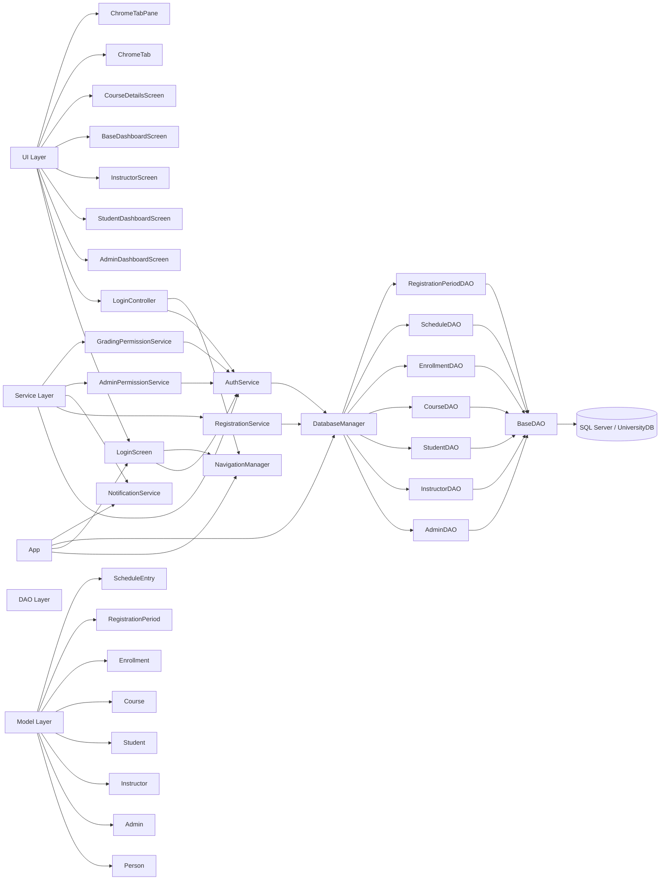
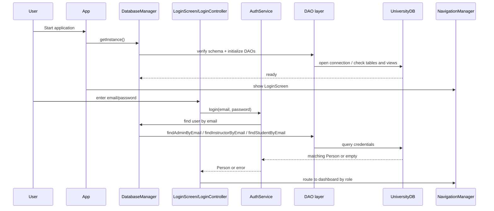
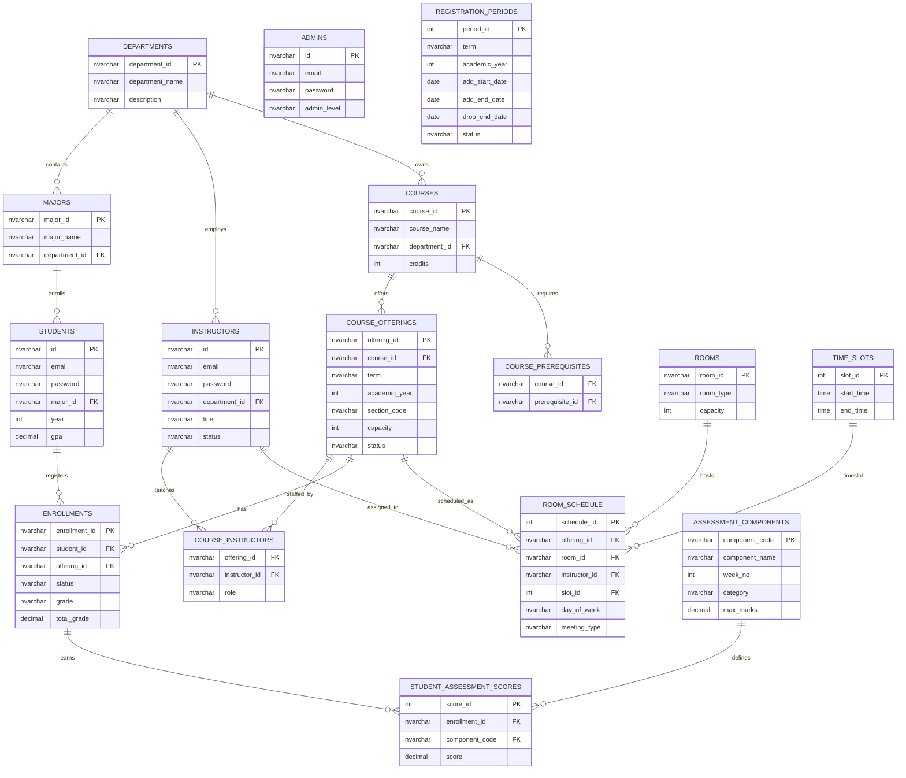
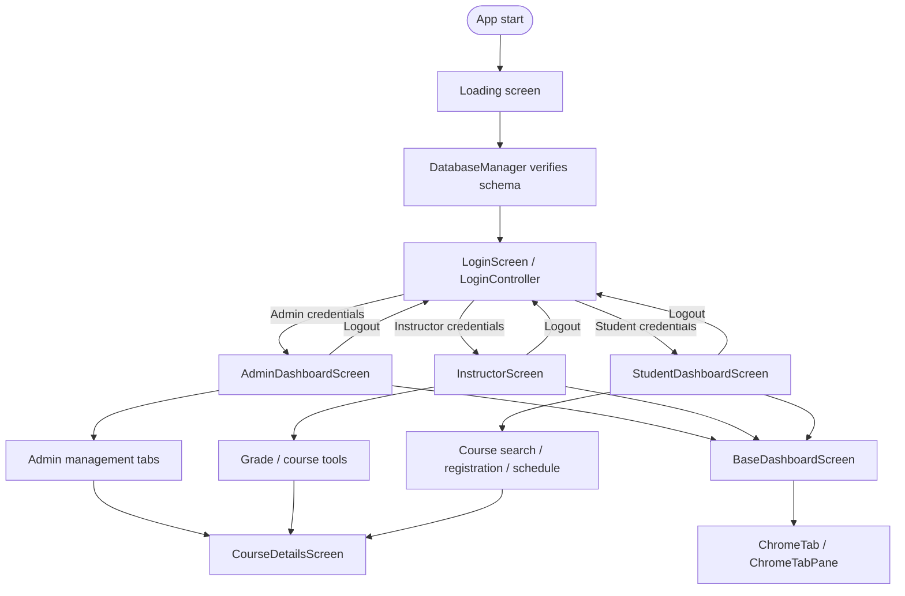

# UniReg — University Registration System

> A full-featured, JavaFX-based academic registration platform built for ECE2104 Object-Oriented Programming, Spring 2025–26.

---

## Table of Contents

- [Problem Statement](#problem-statement)
- [Features](#features)
- [OOP Design](#oop-design)
- [Project Structure](#project-structure)
- [Architecture Overview](#architecture-overview)
- [Class Diagram](#class-diagram)
- [Runtime Flow](#runtime-flow)
- [Database ER Diagram](#database-er-diagram)
- [UI Screen Flow](#ui-screen-flow)
- [Screens & Interfaces](#screens--interfaces)
- [Database](#database)
- [Design Patterns](#design-patterns)
- [Exception Handling](#exception-handling)
- [Getting Started](#getting-started)
- [Demo Credentials](#demo-credentials)
- [Tech Stack](#tech-stack)
- [Bonus Features](#bonus-features)

---

## Problem Statement

Universities struggle with fragmented, error-prone manual registration processes. UniReg solves this by providing a unified, role-based digital platform where **students** register and drop courses, **instructors** manage grades, and **administrators** control the entire academic lifecycle — all with real-time conflict detection, GPA tracking, and prerequisite enforcement.

---

## Features

### Student
- Browse and search all available course offerings
- Enroll in courses with automatic prerequisite, capacity, and time-conflict validation
- Drop courses within the active drop period
- View weekly schedule arranged by day and time slot
- View full academic transcript with component-level grades
- GPA calculator for what-if grade scenarios
- Academic progress dashboard

### Instructor
- View all assigned offerings (lecture, section, lab roles)
- Role-based component grading (Week 7, Week 12, Coursework, Final)
- Weekly teaching schedule
- Teaching load and at-risk student analytics

### Admin
- Full student and instructor CRUD management
- Course and offering management with room and schedule assignment
- Registration period control (open/close per term)
- Admin account management with three permission levels: **SUPER**, **MODERATOR**, **STANDARD**
- Schedule conflict monitor (room conflicts, instructor conflicts, room-type violations)
- System analytics dashboard

---

## OOP Design

The project demonstrates the four pillars of OOP across its entire architecture:

### Inheritance
```
Person (abstract)
├── Student
├── Instructor
└── Admin
```
All user types extend the abstract `Person` class, inheriting identity fields and enforcing `getRole()` and `getSummary()` contracts.

### Polymorphism
- `AuthService.login()` returns a `Person` reference; the UI uses `instanceof` dispatch to route to the correct dashboard.
- `BaseDashboardScreen` declares abstract methods `buildSidebarContent()`, `buildContent()`, and `topBarInfoNodes()`. Each dashboard subclass provides its own implementation.
- `Enrollment.Grade` and `Enrollment.Status` enums with switch-based polymorphic behavior.

### Composition
- `Student` *has* a `List<Enrollment>` — composition, not inheritance.
- `Course` *has* prerequisite IDs, enrolled student IDs, and schedule metadata.
- `DatabaseManager` *has* all DAO instances — Facade composition pattern.
- `AdminDashboardScreen` *has* a `ChromeTabPane` which *has* multiple `ChromeTab` instances.

### Encapsulation
- All model fields are private with getters/setters.
- Business rules (credit limits, prerequisite checks, period checks) are encapsulated inside `RegistrationService`, not scattered in the UI.
- Permission logic is fully encapsulated in `AdminPermissionService` with an `EnumSet`-based permission model.

---

## Project Structure

```
UniReg_Optimized_GoodGUI_Base/
├── src/main/java/com/university/
│   ├── App.java                        # Application entry point
│   ├── dao/                            # Data Access Layer
│   │   ├── BaseDAO.java                # Abstract base with HikariCP pool
│   │   ├── DatabaseManager.java        # Facade over all DAOs
│   │   ├── StudentDAO.java
│   │   ├── InstructorDAO.java
│   │   ├── AdminDAO.java
│   │   ├── CourseDAO.java
│   │   ├── EnrollmentDAO.java
│   │   ├── ScheduleDAO.java
│   │   └── RegistrationPeriodDAO.java
│   ├── model/                          # Domain Model Layer
│   │   ├── Person.java                 # Abstract base
│   │   ├── Admin.java
│   │   ├── Instructor.java
│   │   ├── Student.java
│   │   ├── Course.java
│   │   ├── Enrollment.java
│   │   ├── ScheduleEntry.java
│   │   └── RegistrationPeriod.java
│   ├── service/                        # Business Logic Layer
│   │   ├── AuthService.java
│   │   ├── RegistrationService.java
│   │   ├── NotificationService.java
│   │   ├── AdminPermissionService.java
│   │   └── GradingPermissionService.java
│   ├── ui/                             # Presentation Layer
│   │   ├── LoginScreen.java
│   │   ├── LoginController.java
│   │   ├── BaseDashboardScreen.java    # Abstract dashboard base
│   │   ├── StudentDashboardScreen.java
│   │   ├── InstructorScreen.java
│   │   ├── AdminDashboardScreen.java
│   │   ├── CourseDetailsScreen.java
│   │   ├── ChromeTab.java
│   │   └── ChromeTabPane.java
│   ├── util/                           # Utilities
│   │   ├── UIHelper.java
│   │   ├── GlassTable.java
│   │   ├── NavigationManager.java
│   │   └── Result.java
│   ├── dto/
│   │   └── SystemStats.java
│   └── exception/
│       └── UniversityException.java
├── src/main/resources/
│   ├── com/university/ui/styles.css
│   ├── dark-webview.css
│   └── logback.xml
├── database/
│   ├── message(1).sql                  # Schema creation script
│   └── 01_Reset_And_Seed_...FIXED.sql  # Seed data script
└── pom.xml
```

---

## Architecture Overview



---

## Class Diagram


---

## Runtime Flow

### Startup and Login Sequence



---

## Database ER Diagram



---

## UI Screen Flow



---

## Screens & Interfaces

The application has **7 distinct screens** across 3 user roles, satisfying the minimum requirement of 5 screens.

| # | Screen | Role | Description |
|---|--------|------|-------------|
| 1 | Login Screen | All | Animated brand panel, demo credential quick-fill, inline error display |
| 2 | Student Dashboard | Student | My courses, course registration with filters, weekly schedule, transcript, GPA calculator, progress analytics |
| 3 | Instructor Portal | Instructor | Assigned courses, weekly teaching schedule, role-based component grading, teaching analytics |
| 4 | Admin Dashboard | Admin | Student/instructor CRUD, course/offering management, registration period control, schedule conflict monitor, system analytics |
| 5 | Loading Screen | All | Animated splash with database connection status |


---

## Database

The system uses **Microsoft SQL Server** with a normalized relational schema. All data access uses a **HikariCP connection pool** for performance.

### Key Tables

| Table | Purpose |
|-------|---------|
| `students` | Student accounts and academic info |
| `instructors` | Instructor accounts and department assignment |
| `admins` | Admin accounts with permission level |
| `courses` | Course catalog |
| `course_offerings` | Specific term/section instances of courses |
| `enrollments` | Student-to-offering registration records |
| `assessment_components` | Grade components (W7_LEC, W12_SEC, FINAL, etc.) |
| `student_assessment_scores` | Per-enrollment component scores |
| `room_schedule` | Room, time slot, and instructor per meeting |
| `registration_periods` | Add/drop window per term |

### Key Views

- `vw_student_full` — Student with calculated GPA
- `vw_enrollment_gradebook` — Full grade breakdown per enrollment
- `vw_course_full` — Offering with enrolled count, schedule, instructor names
- `vw_available_offerings` — Open offerings within active registration windows
- `vw_student_transcript` — Complete academic history

### Seed Data

The seed script (`01_Reset_And_Seed_...FIXED.sql`) loads:
- 8 departments, 28 majors
- 80 students, 24 instructors, 4 admins
- 40 courses, 60 offerings
- 270+ enrollments with full assessment score history

---

## What Each Layer Does

### ui
Screens, controllers, navigation, and dashboard composition.

- `App` → Application entry point that initializes the UI and starts the navigation flow.
- `LoginScreen` → Displays the login interface and collects user credentials.
- `LoginController` → Handles login actions and communicates with the service layer.
- `BaseDashboardScreen` → Provides common dashboard functionality shared across user roles.
- `StudentDashboardScreen` → Student dashboard for registration, schedules, grades, and profile access.
- `InstructorScreen` → Faculty dashboard for course management and grading.
- `AdminDashboardScreen` → Administrator dashboard for managing users, courses, and system operations.

### service
Business rules such as authentication, registration, grading, and permissions.

- `AuthService.authenticate()` → Validates user credentials and determines user roles.
- `RegistrationService.enrollStudent()` → Handles student course registration with full validation.
- `RegistrationService.dropCourse()` → Processes course withdrawal requests.
- `RegistrationService.checkPrerequisites()` → Verifies prerequisite requirements.
- `RegistrationService.checkCapacity()` → Ensures seats are available before registration.
- `RegistrationService.calculateScheduleConflicts()` → Detects timetable conflicts.
- `AdminPermissionService` → Enforces SUPER / MODERATOR / STANDARD access rules.
- `GradingPermissionService` → Enforces lecture vs section/lab grading roles.

### dao
All SQL access and schema-specific logic.

- `DatabaseManager` → Central facade for all database operations.
- `StudentDAO` → Manages student-related database operations.
- `InstructorDAO` → Manages instructor-related database operations.
- `CourseDAO` → Handles course retrieval, creation, and updates.
- `ScheduleDAO` → Manages schedule and timetable queries.
- `EnrollmentDAO` → Handles enrollment, grading, and registration records.

### model
Domain objects for people, courses, enrollments, schedules, and periods.

- `Person` → Abstract base for all user types.
- `Student`, `Instructor`, `Admin` → Concrete user types with role-specific fields.
- `Course` → Course catalog and offering data.
- `Enrollment` → Student registration with full grade breakdown.
- `ScheduleEntry` → Timetable row per meeting.
- `RegistrationPeriod` → Add/drop window per academic term.

### util
Reusable UI helpers, navigation, result wrappers, and table helpers.

- `UIHelper` → Factory methods for all styled JavaFX components, animations, and alerts.
- `GlassTable<T>` → Fluent builder for typed glassmorphism-styled `TableView`.
- `NavigationManager` → Singleton screen transition manager.
- `Result<T>` → Typed success/error wrapper for service operations.

---

## Design Patterns

| Pattern | Where Used |
|---------|-----------|
| **Singleton** | `DatabaseManager`, `AuthService`, `RegistrationService`, `NotificationService`, `NavigationManager` — all use double-checked locking |
| **Facade** | `DatabaseManager` exposes a single interface over 7 specialized DAOs |
| **Template Method** | `BaseDashboardScreen` defines the dashboard skeleton; subclasses implement `buildSidebarContent()`, `buildContent()`, `topBarInfoNodes()` |
| **Builder** | `GlassTable<T>` fluent builder API for typed table construction |
| **Strategy** | `AdminPermissionService` applies different permission sets based on admin level using `EnumSet` |
| **Observer** | JavaFX property bindings and `selectedItemProperty` listeners throughout the UI |

---

## Exception Handling

All exceptions are caught and handled at appropriate boundaries:

- **`UniversityException`** — custom checked exception for all business rule violations (prerequisite not met, course full, period closed, credit limit exceeded, time conflict)
- **Database errors** — wrapped in `RuntimeException` inside `BaseDAO`, surfaced to UI via `UIHelper.showError()`
- **Login failures** — caught in `LoginScreen` and `LoginController`, displayed inline without crashing
- **Dashboard routing errors** — wrapped in try-catch in `LoginScreen.routeUser()` with full stack trace printed to console
- **Schema verification** — `DatabaseManager` validates all required tables and views on startup; fails fast with a descriptive error dialog before showing any UI
- **Null safety** — all DAO mappers handle nullable columns; model setters guard against null lists

---

## Getting Started

### Prerequisites

- Java 21+
- Maven 3.8+
- Microsoft SQL Server (local instance or remote)
- SQL Server instance with `UniversityDB` database

### 1. Set Up the Database

Connect to your SQL Server instance and run the scripts in order:

```sql
-- Step 1: Create schema
-- Run: database/message(1).sql

-- Step 2: Seed data
-- Run: database/01_Reset_And_Seed_OptionB_Dummy_Data_FIXED (1).sql
```

### 2. Configure Connection

The app reads connection settings from environment variables. Set them if your instance differs from the defaults:

| Variable | Default |
|----------|---------|
| `UNIVERSITY_DB_SERVER` | `localhost` |
| `UNIVERSITY_DB_NAME` | `UniversityDB` |
| `UNIVERSITY_DB_USER` | `university_user` |
| `UNIVERSITY_DB_PASSWORD` | `UniPass123!` |

**Windows (PowerShell):**
```powershell
$env:UNIVERSITY_DB_SERVER = "localhost"
$env:UNIVERSITY_DB_PASSWORD = "UniPass123!"
```

**macOS / Linux:**
```bash
export UNIVERSITY_DB_SERVER=localhost
export UNIVERSITY_DB_PASSWORD=UniPass123!
```

### 3. Build and Run

```bash
# Navigate to the project module
cd UniReg_Optimized_GoodGUI_Base

# Compile
mvn clean compile

# Run
mvn javafx:run
```

Or from the repo root using the helper script:

```bash
./run-app.sh
```

---

## Demo Credentials

| Role | Email | Password |
|------|-------|----------|
| Super Admin | `super.admin@university.edu` | `admin123` |
| Moderator Admin | `moderator.admin@university.edu` | `admin123` |
| Standard Admin | `standard.admin@university.edu` | `admin123` |
| Instructor | `instructor001@university.edu` | `ins123` |
| Student | `student001@university.edu` | `stu123` |

---

## Tech Stack

| Technology | Version | Purpose |
|------------|---------|---------|
| Java | 21 | Core language |
| JavaFX | 21.0.2 | UI framework |
| Microsoft SQL Server | 2019+ | Relational database |
| mssql-jdbc | 12.4.2 | JDBC driver |
| HikariCP | 5.1.0 | Connection pooling |
| SLF4J + Logback | 2.0.9 / 1.4.11 | Logging |
| Maven | 3.8+ | Build system |

---

## Bonus Features

All bonus criteria from the project guidelines are implemented:

| Bonus Criterion | Implementation |
|-----------------|---------------|
| ✅ **Database** | Full SQL Server integration with normalized schema, views, indexes, and HikariCP pooling |
| ✅ **Attractive GUI** | Dark glassmorphism theme, animated particle background, glowing gradients, animated stat cards, CSS-driven component library |
| ✅ **Multithreading** | Database connection initialized on a daemon thread at startup; `NotificationService` uses `ScheduledExecutorService` for async notifications; JavaFX `AnimationTimer` and `Timeline` for live animations |
| ✅ **Design Patterns** | Singleton, Facade, Template Method, Builder, Strategy, Observer — documented above |
| ✅ **Outside Course Scope** | HikariCP connection pooling, SLF4J/Logback structured logging, JavaFX CSS theming system, SQL Server stored views and triggers |

---

## Reading Order

1. `App`
2. `DatabaseManager`
3. `AuthService`
4. `LoginScreen` and `LoginController`
5. `BaseDashboardScreen` and the three dashboard screens
6. `RegistrationService`
7. The DAO classes
8. The model classes

---

*ECE2104 Object Oriented Programming — Spring 2025–26 — AASTMT*