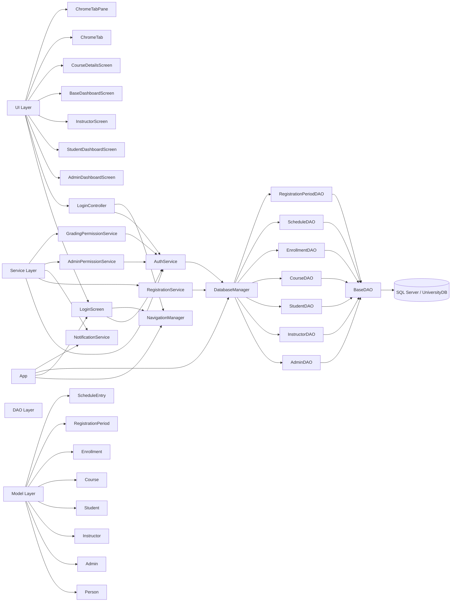
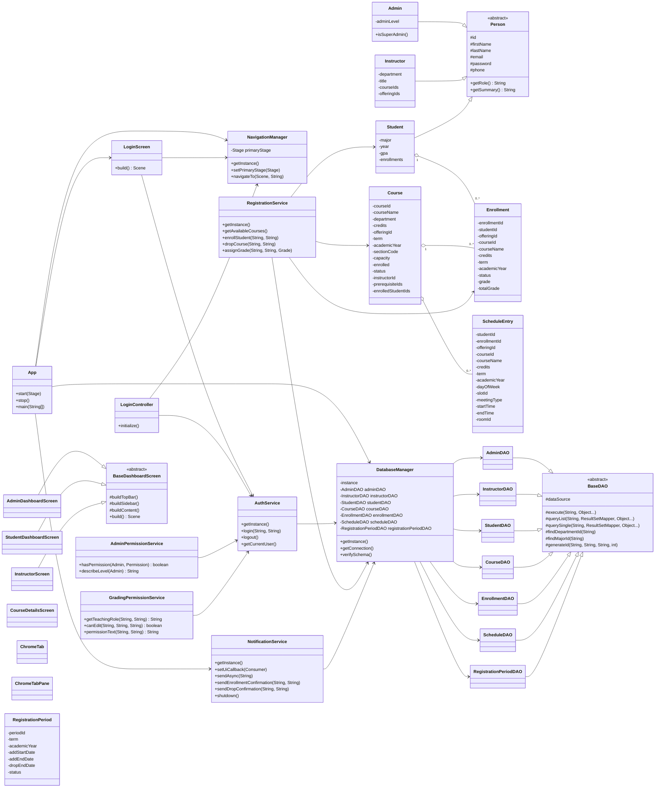
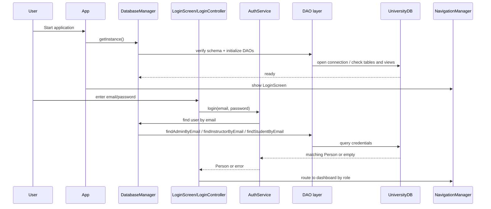

# Project UML

This diagram set shows the main layers of the university registration system and how they connect.

## 1) High-level architecture

## 2) Core class diagram

## 3) Runtime flow: startup and login

## 4) What each layer does

- `ui`: screens, controllers, navigation, and dashboard composition.
- `service`: business rules such as authentication, registration, grading, and permissions.
- `dao`: all SQL access and schema-specific logic.
- `model`: domain objects for people, courses, enrollments, schedules, and periods.
- `util`: reusable UI helpers, navigation, result wrappers, and table helpers.
- `dto`: lightweight report objects like `SystemStats`.
- `exception`: app-specific error types.

## 5) Reading order

1. `App`
2. `DatabaseManager`
3. `AuthService`
4. `LoginScreen` and `LoginController`
5. `BaseDashboardScreen` and the three dashboard screens
6. `RegistrationService`
7. The DAO classes
8. The model classes

This is the fastest path to understanding the project end-to-end.

## 6) Database ER diagram

## 7) UI screen flow

