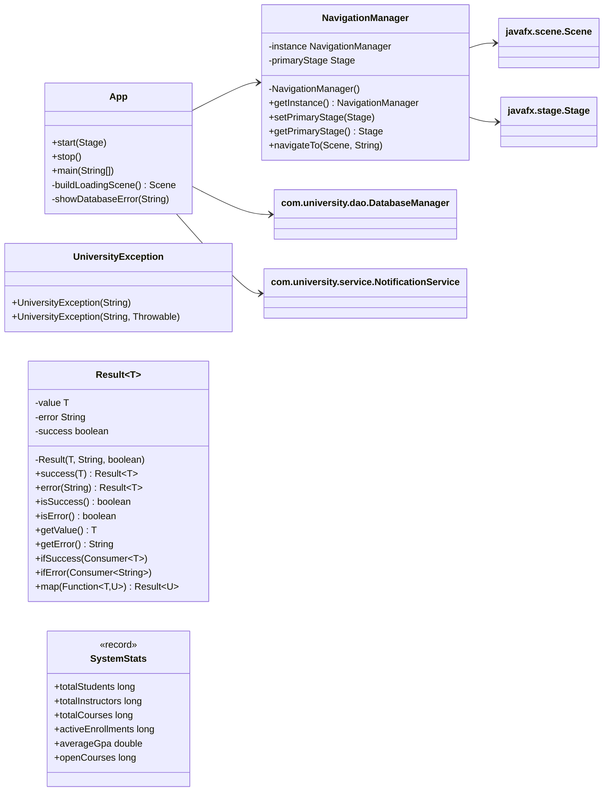
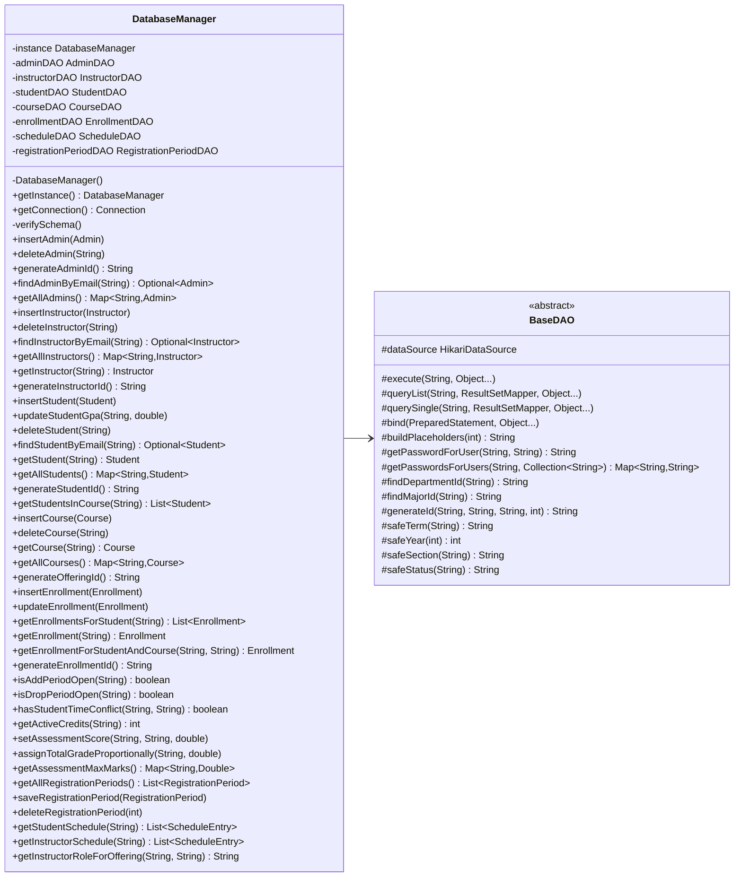
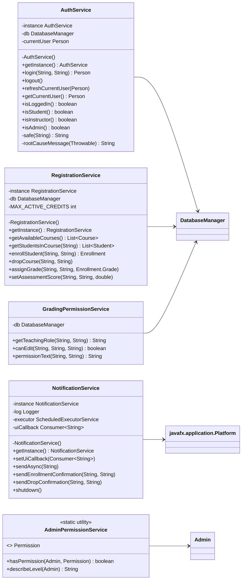
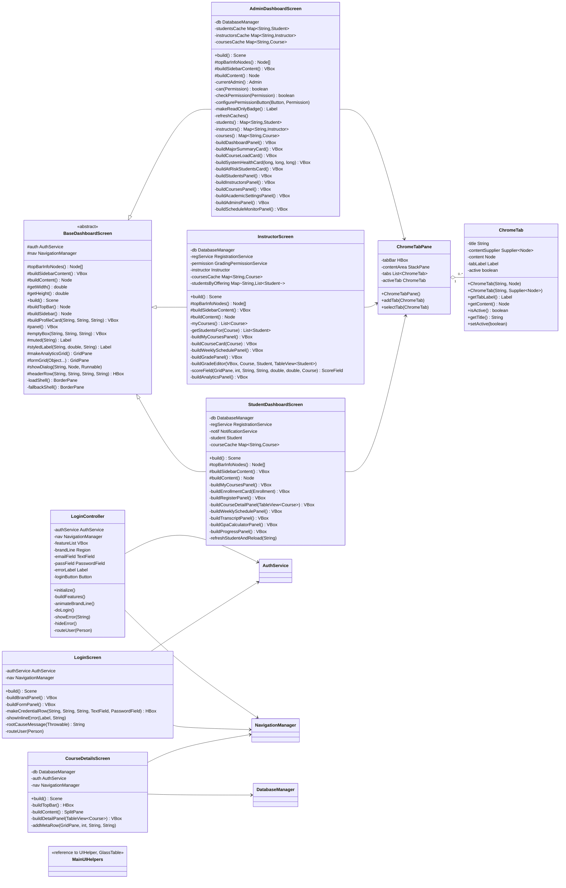
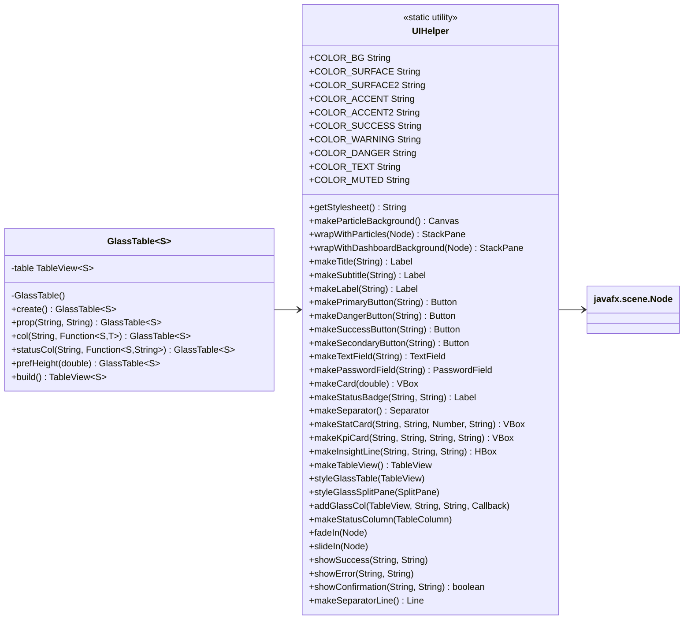
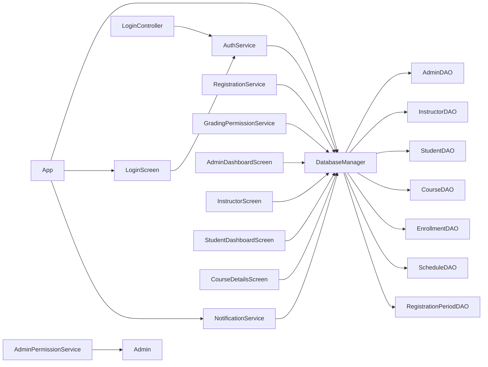

# Project UML - Full Detail

This version expands the main classes with their fields and the important methods used by the application.

## Legend

- `<<abstract>>` means the class is abstract.
- `<<record>>` means the class is a Java record.
- `+` public member
- `#` protected member
- `-` private member

## 1) Application and navigation

## 2) Base data access and database manager

## 3) Services

## 4) Domain model

```mermaid
classDiagram
    direction LR

    class Person {
        <<abstract>>
        -serialVersionUID long
        -id String
        -firstName String
        -lastName String
        -email String
        -password String
        -phone String
        #Person()
        #Person(String, String, String, String, String, String)
        +getRole()* String
        +getSummary()* String
        +getFullName() String
        +getId() String
        +setId(String)
        +getFirstName() String
        +setFirstName(String)
        +getLastName() String
        +setLastName(String)
        +getEmail() String
        +setEmail(String)
        +getPassword() String
        +setPassword(String)
        +getPhone() String
        +setPhone(String)
        +toString() String
    }

    class Admin {
        -serialVersionUID long
        -adminLevel String
        +Admin()
        +Admin(String, String, String, String, String, String, String)
        +getRole() String
        +getSummary() String
        +isSuperAdmin() boolean
        +isModeratorAdmin() boolean
        +isStandardAdmin() boolean
        +getAdminLevel() String
        +setAdminLevel(String)
    }

    class Instructor {
        -serialVersionUID long
        -department String
        -title String
        -courseIds List~String~
        -offeringIds List~String~
        +Instructor()
        +Instructor(String, String, String, String, String, String, String, String)
        +getRole() String
        +getSummary() String
        +addCourse(String)
        +removeCourse(String)
        +addOffering(String)
        +removeOffering(String)
        +getDepartment() String
        +setDepartment(String)
        +getTitle() String
        +setTitle(String)
        +getCourseIds() List~String~
        +setCourseIds(List~String~)
        +getOfferingIds() List~String~
        +setOfferingIds(List~String~)
    }

    class Student {
        -serialVersionUID long
        -major String
        -year int
        -gpa double
        -enrollments List~Enrollment~
        +Student()
        +Student(String, String, String, String, String, String, String, int)
        +getRole() String
        +getSummary() String
        +getYearLabel() String
        +isEnrolledIn(String) boolean
        +getTotalCredits() int
        +getActiveCredits() int
        +getMajor() String
        +setMajor(String)
        +getYear() int
        +setYear(int)
        +getGpa() double
        +setGpa(double)
        +getEnrollments() List~Enrollment~
        +setEnrollments(List~Enrollment~)
        +addEnrollment(Enrollment)
    }

    class Course {
        -serialVersionUID long
        <<enum>> Status
        -courseId String
        -courseName String
        -department String
        -credits int
        -description String
        -offeringId String
        -term String
        -academicYear int
        -sectionCode String
        -capacity int
        -enrolled int
        -status Status
        -instructorId String
        -instructorName String
        -instructorRole String
        -schedule String
        -room String
        -dayOfWeek String
        -slotId Integer
        -meetingType String
        -roomType String
        -prerequisiteIds List~String~
        -enrolledStudentIds List~String~
        +Course()
        +Course(String, String, String, int, int, String, String, String, String, String)
        +Course(String, String, String, String, int, String, int, String, int, int, String, String, String, String, String, Status)
        +hasAvailableSeats() boolean
        +getAvailableSeats() int
        +enrollStudent(String) boolean
        +dropStudent(String) boolean
        +getDisplayCode() String
        +getCourseId() String
        +setCourseId(String)
        +getCourseName() String
        +setCourseName(String)
        +getDepartment() String
        +setDepartment(String)
        +getCredits() int
        +setCredits(int)
        +getDescription() String
        +setDescription(String)
        +getOfferingId() String
        +setOfferingId(String)
        +getTerm() String
        +setTerm(String)
        +getAcademicYear() int
        +setAcademicYear(int)
        +getSectionCode() String
        +setSectionCode(String)
        +getCapacity() int
        +setCapacity(int)
        +getEnrolled() int
        +setEnrolled(int)
        +getStatus() Status
        +setStatus(Status)
        +getInstructorId() String
        +setInstructorId(String)
        +getInstructorName() String
        +setInstructorName(String)
        +getInstructorRole() String
        +setInstructorRole(String)
        +getSchedule() String
        +setSchedule(String)
        +getRoom() String
        +setRoom(String)
        +getDayOfWeek() String
        +setDayOfWeek(String)
        +getSlotId() Integer
        +setSlotId(Integer)
        +getMeetingType() String
        +setMeetingType(String)
        +getRoomType() String
        +setRoomType(String)
        +getPrerequisiteIds() List~String~
        +setPrerequisiteIds(List~String~)
        +getEnrolledStudentIds() List~String~
        +setEnrolledStudentIds(List~String~)
    }

    class Enrollment {
        -serialVersionUID long
        <<enum>> Status
        <<enum>> Grade
        -enrollmentId String
        -studentId String
        -offeringId String
        -courseId String
        -courseName String
        -credits int
        -term String
        -academicYear int
        -enrollmentDate LocalDate
        -status Status
        -grade Grade
        -gradePoints double
        -week7Lecture double
        -week7Section double
        -week12Lecture double
        -week12Section double
        -coursework double
        -finalExam double
        -totalGrade double
        -maxGrade double
        -percentage double
        -gradedComponents int
        -totalComponents int
        +Enrollment()
        +Enrollment(String, String, String, String, int)
        +Enrollment(String, String, String, String, String, int, String, int)
        +getGradeDisplay() String
        +getGradePoints() double
        +isActive() boolean
        +matchesCourseOrOffering(String) boolean
        +getDbStatus() String
        +statusFromDb(String) Status
        +gradeFromLetter(String) Grade
        +targetTotalForGrade(Grade) double
        +setGradeFromLetter(String)
        +getEnrollmentId() String
        +setEnrollmentId(String)
        +getStudentId() String
        +setStudentId(String)
        +getOfferingId() String
        +setOfferingId(String)
        +getCourseId() String
        +setCourseId(String)
        +getCourseName() String
        +setCourseName(String)
        +getCredits() int
        +setCredits(int)
        +getTerm() String
        +setTerm(String)
        +getAcademicYear() int
        +setAcademicYear(int)
        +getEnrollmentDate() LocalDate
        +setEnrollmentDate(LocalDate)
        +getStatus() Status
        +setStatus(Status)
        +getGrade() Grade
        +setGrade(Grade)
        +setGradePoints(double)
        +getWeek7Lecture() double
        +setWeek7Lecture(double)
        +getWeek7Section() double
        +setWeek7Section(double)
        +getWeek12Lecture() double
        +setWeek12Lecture(double)
        +getWeek12Section() double
        +setWeek12Section(double)
        +getCoursework() double
        +setCoursework(double)
        +getFinalExam() double
        +setFinalExam(double)
        +getTotalGrade() double
        +setTotalGrade(double)
        +getMaxGrade() double
        +setMaxGrade(double)
        +getPercentage() double
        +setPercentage(double)
        +getGradedComponents() int
        +setGradedComponents(int)
        +getTotalComponents() int
        +setTotalComponents(int)
    }

    class RegistrationPeriod {
        -periodId int
        -term String
        -academicYear int
        -addStartDate LocalDate
        -addEndDate LocalDate
        -dropEndDate LocalDate
        -status String
        +RegistrationPeriod()
        +RegistrationPeriod(int, String, int, LocalDate, LocalDate, LocalDate, String)
        +isOpen() boolean
        +getPeriodId() int
        +setPeriodId(int)
        +getTerm() String
        +setTerm(String)
        +getAcademicYear() int
        +setAcademicYear(int)
        +getAddStartDate() LocalDate
        +setAddStartDate(LocalDate)
        +getAddEndDate() LocalDate
        +setAddEndDate(LocalDate)
        +getDropEndDate() LocalDate
        +setDropEndDate(LocalDate)
        +getStatus() String
        +setStatus(String)
    }

    class ScheduleEntry {
        -studentId String
        -enrollmentId String
        -offeringId String
        -courseId String
        -courseName String
        -credits int
        -term String
        -academicYear int
        -sectionCode String
        -dayOfWeek String
        -slotId int
        -meetingType String
        -startTime String
        -endTime String
        -roomId String
        -roomType String
        -instructorIds String
        -instructorNames String
        -enrollmentStatus String
        +getTimeRange() String
        +getStudentId() String
        +setStudentId(String)
        +getEnrollmentId() String
        +setEnrollmentId(String)
        +getOfferingId() String
        +setOfferingId(String)
        +getCourseId() String
        +setCourseId(String)
        +getCourseName() String
        +setCourseName(String)
        +getCredits() int
        +setCredits(int)
        +getTerm() String
        +setTerm(String)
        +getAcademicYear() int
        +setAcademicYear(int)
        +getSectionCode() String
        +setSectionCode(String)
        +getDayOfWeek() String
        +setDayOfWeek(String)
        +getSlotId() int
        +setSlotId(int)
        +getMeetingType() String
        +setMeetingType(String)
        +getStartTime() String
        +setStartTime(String)
        +getEndTime() String
        +setEndTime(String)
        +getRoomId() String
        +setRoomId(String)
        +getRoomType() String
        +setRoomType(String)
        +getInstructorIds() String
        +setInstructorIds(String)
        +getInstructorNames() String
        +setInstructorNames(String)
        +getEnrollmentStatus() String
        +setEnrollmentStatus(String)
    }

    Person <|-- Admin
    Person <|-- Instructor
    Person <|-- Student
    Student "1" o-- "0..*" Enrollment
```

## 5) DAO layer

```mermaid
classDiagram
    direction LR

    class AdminDAO {
        +insertAdmin(Admin)
        +findAdminByEmail(String) Optional~Admin~
        +getAllAdmins() Map~String,Admin~
        +deleteAdmin(String)
        +generateAdminId() String
        -mapAdmin(ResultSet) Admin
        -safeAdminLevel(String) String
    }

    class InstructorDAO {
        +insertInstructor(Instructor)
        +deleteInstructor(String)
        +findInstructorByEmail(String) Optional~Instructor~
        +getInstructor(String) Instructor
        +getAllInstructors() Map~String,Instructor~
        +generateInstructorId() String
        -mapInstructorFromView(ResultSet) Instructor
        -csvToList(String) List~String~
    }

    class StudentDAO {
        +insertStudent(Student)
        +updateStudentGpa(String, double)
        +deleteStudent(String)
        +findStudentByEmail(String) Optional~Student~
        +getStudent(String) Student
        +getAllStudents() Map~String,Student~
        +generateStudentId() String
        +getStudentsInCourse(String) List~Student~
        +getStudentsByIds(List~String~) List~Student~
        +getEnrollmentsForStudents(Collection~String~) Map~String,List~Enrollment~~
        +getEnrollmentsForStudent(String) List~Enrollment~
        -mapStudentFromView(ResultSet) Student
        -mapStudentFromView(ResultSet, String, List~Enrollment~) Student
        -mapEnrollmentFromGradebook(ResultSet) Enrollment
    }

    class CourseDAO {
        +insertCourse(Course)
        +deleteCourse(String)
        +getCourse(String) Course
        +getAllCourses() Map~String,Course~
        +generateOfferingId() String
        -mapCourseFromView(ResultSet) Course
        -mapCourseFromView(ResultSet, List~String~, List~String~) Course
        -firstScheduleBits(String)
        -getOfferingIdByCourseOrNull(String, String, int, String) String
        -ensureRegistrationPeriod(String, int)
        -safeMeetingType(String) String
        -safeInstructorRole(String, String) String
        -getPrerequisitesForCourse(String) List~String~
        -getPrerequisitesForCourses(Collection~String~) Map~String,List~String~~
        -getEnrolledStudentIdsForOffering(String) List~String~
        -getEnrolledStudentIdsForOfferings(Collection~String~) Map~String,List~String~~
    }

    class EnrollmentDAO {
        +insertEnrollment(Enrollment)
        +updateEnrollment(Enrollment)
        +getEnrollmentsForStudent(String) List~Enrollment~
        +getEnrollment(String) Enrollment
        +getEnrollmentForStudentAndCourse(String, String) Enrollment
        +generateEnrollmentId() String
        +isAddPeriodOpen(String) boolean
        +isDropPeriodOpen(String) boolean
        +hasStudentTimeConflict(String, String) boolean
        +getActiveCredits(String) int
        +setAssessmentScore(String, String, double)
        +assignTotalGradeProportionally(String, double)
        +getAssessmentMaxMarks() Map~String,Double~
        -mapEnrollmentFromGradebook(ResultSet) Enrollment
    }

    class RegistrationPeriodDAO {
        +getAllRegistrationPeriods() List~RegistrationPeriod~
        +saveRegistrationPeriod(RegistrationPeriod)
        +deleteRegistrationPeriod(int)
        -mapPeriod(ResultSet) RegistrationPeriod
        -safePeriodStatus(String) String
    }

    class ScheduleDAO {
        +getStudentSchedule(String) List~ScheduleEntry~
        +getInstructorSchedule(String) List~ScheduleEntry~
        +getInstructorRoleForOffering(String, String) String
        -mapScheduleEntry(ResultSet) ScheduleEntry
    }

    AdminDAO --|> BaseDAO
    InstructorDAO --|> BaseDAO
    StudentDAO --|> BaseDAO
    CourseDAO --|> BaseDAO
    EnrollmentDAO --|> BaseDAO
    RegistrationPeriodDAO --|> BaseDAO
    ScheduleDAO --|> BaseDAO
```

## 6) UI and screens

## 7) Utility helpers

## 8) Layer relationships

## 9) How to read the project

1. Start with `App` and `NavigationManager`.
2. Follow the login path through `LoginScreen` or `LoginController` into `AuthService`.
3. Read `DatabaseManager` to see the DAO composition.
4. Read `BaseDAO` for all shared SQL helpers.
5. Read the domain model in `Person`, `Admin`, `Instructor`, `Student`, `Course`, `Enrollment`.
6. Read `AdminDashboardScreen`, `StudentDashboardScreen`, and `InstructorScreen` for the UI feature flow.
7. Read `UIHelper` and `GlassTable` for the reusable UI infrastructure.

If you want, I can now generate a matching `PROJECT_ERD.md` and `PROJECT_SEQUENCE.md` so the database and runtime flow each have their own full-detail diagram file.
